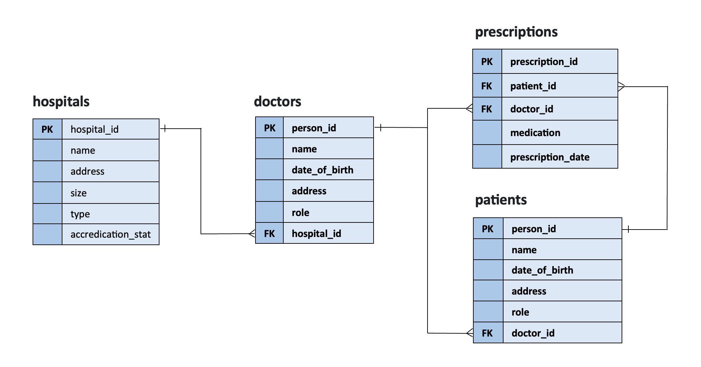

# **Assignment 1**

## ***Project Overview***

This project invloves creating a Hospital Database in SQL to manage .csv file data provided for the following tables: hospitals, doctors, patients, and prescriptions. It includes the database design, SQL queries, and planning documents to demonstrate the relationships between entities and database functionality.

**Repository**

**ERD and Planning**

Contains Entity Relationship Diagram (ERD) 

**Hospital Database**

Database SQL File: hospital_database.sql – .sql file containing the database schema, tables, relationships, and initial data loaded from .csv files

***CSV Files***

-	doctors.csv – List of doctors
-	patients.csv – List of patients
-	hospitals.csv – List of hospitals
-	prescriptions.csv – List of prescriptions

***SQL queries***

1. List all doctors at a particular hospital
2. List all prescriptions for a particular patient (ordered by date)
3. List all prescriptions prescribed by a particular doctor
4. Add a new patient and assign to a doctor
5. Identify the doctor with the most prescriptions
6. List all doctors at the largest hospital (by number of beds)
